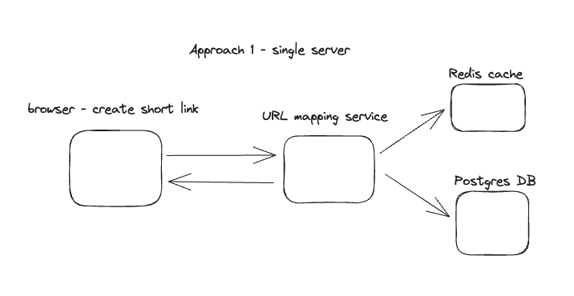
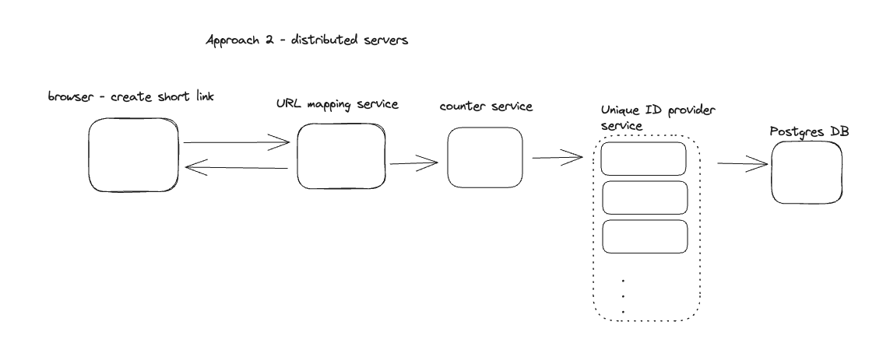
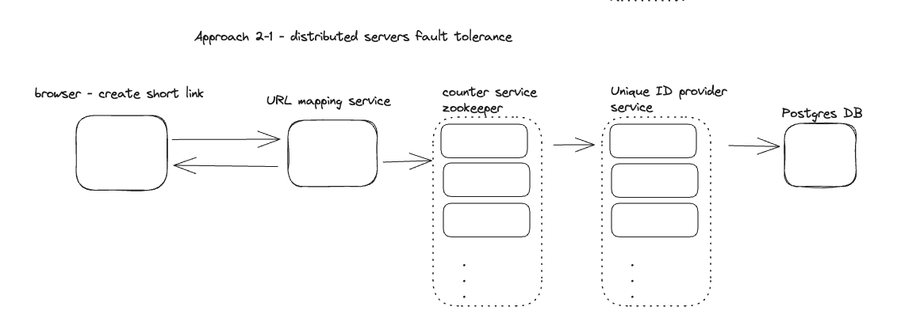

# tinyurl

This project covers cases with shortening URL topics.

# Tech Specs:

- [x] Reactjs

- [x] Echo Golang framework

# Patterns

Use random integer to encode62 
- https://this-is-long-url -> encoder62(randomString) -> https://s.io/this-is-short-url

- https://this-is-long-url -> generateInt(counter.generateForEachServer(serverA)) -> encoder62(randomString) -> https://s.io/this-is-short-url

# Architecture:

- [x] Single server

- [x] Distribution servers.

- [x] Zookeeper

- [x] Cache service.

- [ ] Load balancer.

# TODOS:

- [x] Shorten link

- [x] Zookeeper

# Get Started

- Run Postgres DB container: `docker-compose up -d`

- `make run`
