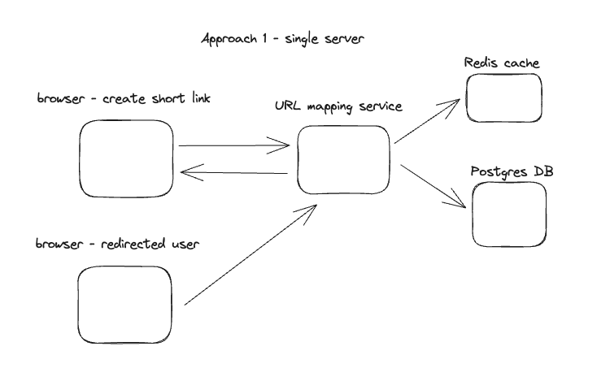

# tinyurl

This project covers cases with shortening URL topics.

# Tech Specs:

- [x] Reactjs

- [x] Echo Golang framework

# Architecture:

- [x] Single server

- [x] Distribution servers.

- [x] Cache service.

- [ ] Load balancer.

# TODOS:

- [x] Shorten link

- [x] Zookeeper

# Get Started

- Run Postgres DB container: `docker-compose up -d`

- `make run`
